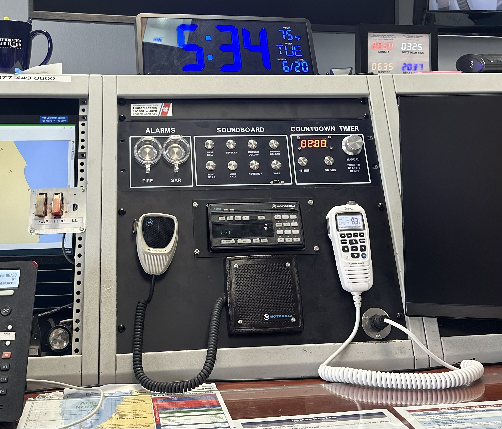
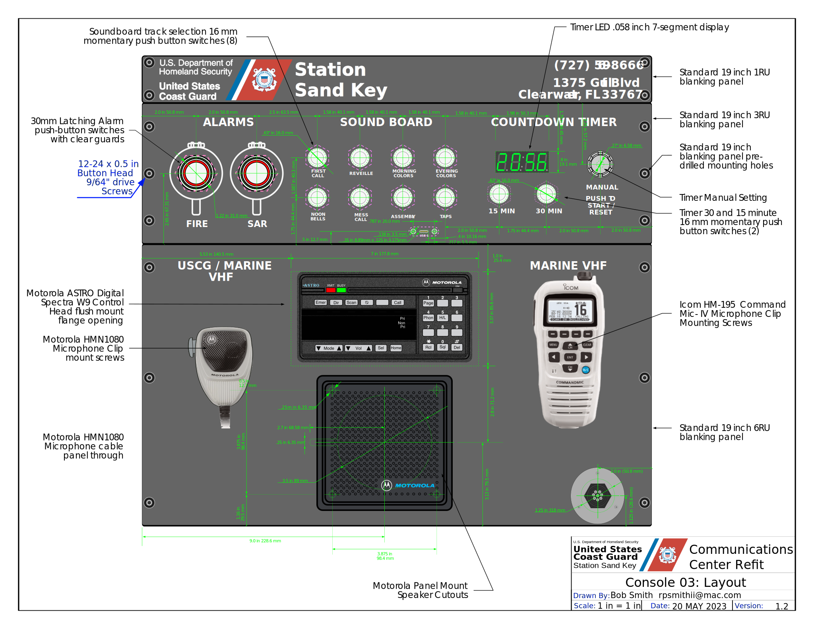
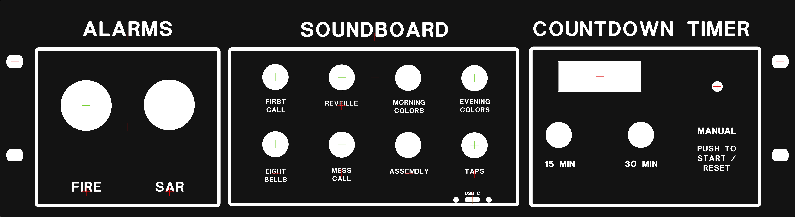

# U.S. Coast Guard Communications Center Console

by [Bob Smith](https://github.com/bethanysciences/Communications_Console)

Customized standard 19" rack components for U.S. Coast Guard boat station communication room console.

Custom cut pannels accomodate
- Radio section
  - flush mount for Motorola Astro P25 encrypted radio
  - Motorola speaker
  - Microphone hanger
  - Icom MB400 Radio hanger
- Applications section
  - Fire and SAR alarm activation switches
  - Soundboard to pipe signals through station public address system
  - Countdown timer to manage patrol communications intervals

-----------------------------------------------

## Alarm Activation Switches

[30mm SPDT 12V Stainless Steel Latching Push Button Switch   Angel Eye Red LED](https://www.amazon.com/dp/B09289P6G3/?coliid=I60I49QO0BY87&colid=1A6K5RJO69A4Q&psc=1&ref_=list_c_wl_lv_ov_lig_dp_it) converted to DPDT to accomodate 12v switched indicator light.

-----------------------------------------------

## Sound Board

Plays U.S. Coast Guard unit bugle calls.

|   Call          |  Wire  | Slot | file name |
|-----------------|--------|------|-----------|
|  First Call     | brown  |   1  | 00001.mp3 |
|  Reveille       | orange |   2  | 00002.mp3 |
|  Morning Colors | yellow |   3  | 00003.mp3 |
|  Evening Colors | blue   |   4  | 00004.mp3 |
|  Eight Bells    | pink   |   5  | 00005.mp3 |
|  Mess Call      | green  |   6  | 00006.mp3 |
|  Assembly       | white  |   7  | 00007.mp3 |
|  Taps           | purple |   8  | 00008.mp3 |

[Pemenol DY-HL30T Audio Playback Module](https://www.amazon.com/Playback-PEMENOL-Broadcast-Interfaces-Indicators/dp/B0C5ZLC84B/ref=sr_1_3?crid=89VG0OZFIM07&keywords=30+watt+playback+module&qid=1686250968&sprefix=30+watt+playback+module%2Caps%2C115&sr=8-3)

### Specifications

1. 9-24V DC (minimum 9V)
2. 30W Class D power amplifier driving 4-8Ω 10-30W speakers
3. Trigger interface for up to 9 tracks
4. Level inputs: S1 S2 S3 S4 S5 S6 S7 S8 S9 min 0V max 0.3V
5. MP3 and WAV audio formats w/ sampling rate up to 48KHz
6. SD Micro card slot supporting 32G maximum FAT32 formated storage
7. USB micro data port to access SD Micro card
8. Trips warning light externally (warning light voltage should be consistent w/ input voltage)
9. 8 trigger modes
10. Volume potentiometer

[16mm Stainless Steel Push Button Switchs](https://www.amazon.com/dp/B07QBYDRT4/?coliid=I1X7QEIBETYUN8&colid=1A6K5RJO69A4Q&ref_=list_c_wl_lv_ov_lig_dp_it&th=1)

-----------------------------------------------

## Countdown Timer

Rack mounted basic countdown timer to set quickly set and manager interval between patrol check-ins, usually 30-minutes or 15-minutes in bad weather or air operations. When complete loud, a loud customized note and duration alarm alerts to next call.

[Code](Countdown_Timer/countdown/countdown.ino)

### Features

- Set and start 15 or 30-minute countdown using single buttons
- Dial in 1 to 99-minutes using rotary encoder
- Outputs minutes and seconds to 4-digit 7-segment LED display

### Componants Used

- [Arduino Nano Every](https://store-usa.arduino.cc/products/arduino-nano-every)
- [Adafruit I2C Rotary Encoder Breakout](https://www.adafruit.com/product/4991)
- [Adafruit Rotary Encoder](https://www.adafruit.com/product/377)
- [TM1637 based 0.56" high 7-segment LED display](https://www.amazon.com/diymore-Display-Digital-Decimal-Segment/dp/B07MCGDST2/ref=sr_1_6?crid=2KB0SJVDRC588&keywords=tm1637+led+display&qid=1687116410&sprefix=tm1637+led+display%2Caps%2C203&sr=8-6)
- [Passive Buzzer Module](https://www.amazon.com/RLECS-Passive-Arduino-Raspberry-Speaker/dp/B07XDPXH7K/ref=asc_df_B07XDPXH7K/?tag=hyprod-20&linkCode=df0&hvadid=632016782313&hvpos=&hvnetw=g&hvrand=3559400587378035192&hvpone=&hvptwo=&hvqmt=&hvdev=c&hvdvcmdl=&hvlocint=&hvlocphy=9012147&hvtargid=pla-1944578464961&psc=1)
- 2 momentary pushbutton switches [16mm Stainless Steel Push Button Switchs](https://www.amazon.com/dp/B07QBYDRT4/?coliid=I1X7QEIBETYUN8&colid=1A6K5RJO69A4Q&ref_=list_c_wl_lv_ov_lig_dp_it&th=1)

### Compiler

- [Using Arduino 2.1.0 IDE](https://github.com/arduino/arduino-ide)
- [Arduno platform-specification](https://arduino.github.io/arduino-cli/latest/platform-specification/)

### Supported Core(s)

- [Arduino megaAVG Boards 1.8.8](https://github.com/arduino/ArduinoCore-megaavr)

### Libraries used

- [Jack Christensen's JC_Button library v2.1.2](https://github.com/JChristensen/JC_Button)
- [Adafruit's seesaw library v1.7.0](https://github.com/adafruit/Adafruit_Seesaw)
- [Rob Tillaart's CountDown library v0.3.1](https://github.com/RobTillaart/CountDown)
- [Rob Tillaart's TM1637 library v0.3.7](https://github.com/RobTillaart/TM1637_RT)

-----------------------------------------------

## Panel Preparation

Prepared by [Front Panel Express, LLC](frontpanelexpress.com)

### 3 Rack Unit (RU) high panel 
### 6 Rack Unit (RU) high panel 